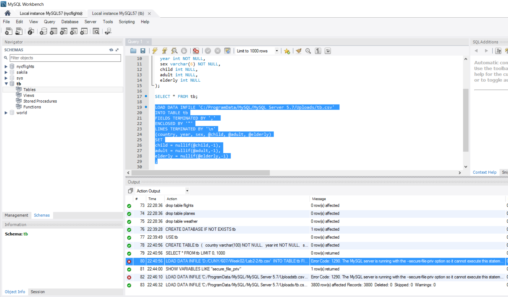

Following SQL code is used to create tb_Afghanistan.csv.

```
CREATE DATABASE IF NOT EXISTS tb;

USE tb;

DROP TABLE IF EXISTS tb;

CREATE TABLE tb 
(
  country varchar(100) NOT NULL,
  year int NOT NULL,
  sex varchar(6) NOT NULL,
  child int NULL,
  adult int NULL,
  elderly int NULL
);

SELECT * FROM tb;

LOAD DATA INFILE 'C:/ProgramData/MySQL/MySQL Server 5.7/Uploads/tb.csv' 
INTO TABLE tb
FIELDS TERMINATED BY ',' 
ENCLOSED BY '"'
LINES TERMINATED BY '\n'
(country, year, sex, @child, @adult, @elderly)
SET
child = nullif(@child,-1),
adult = nullif(@adult,-1),
elderly = nullif(@elderly,-1)
;

SELECT * FROM tb WHERE elderly IS NULL;
SELECT COUNT(*) FROM tb;

#SHOW VARIABLES LIKE "secure_file_priv";

SELECT 
	country,
    `year`,
    SUM(IFNULL(child,0)+IFNULL(adult,0)+IFNULL(elderly,0)) AS `cases` 
INTO OUTFILE 'C:/ProgramData/MySQL/MySQL Server 5.7/Uploads/tb_Afghanistan.csv'
FIELDS TERMINATED BY ',' OPTIONALLY ENCLOSED BY '"'
ESCAPED BY '\\'
LINES TERMINATED BY '\n'
FROM tb 
WHERE country = 'Afghanistan'
GROUP BY country,`year`;
```
While using working directory other than *C:/ProgramData/MySQL/MySQL Server 5.7/Uploads*, I got error. I have changed path in the SQL to import and export files *tb.csv* and *tb_Afghanistan.csv* files respectively.


